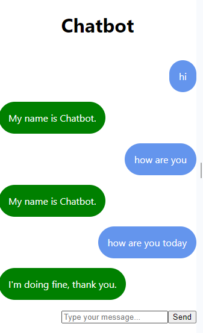

# Support Chatbot

## Author
LemonBaba

## Decision Responsive or Generative Chatbot
I lost a lot of time in executing training scripts for the generative chatbot. So I decided to make a responsive one.

## Use Cases
Support Chat
E-commerce

## Used Techniques
| Technique                       | Description                                                                                |
|---------------------------------|--------------------------------------------------------------------------------------------|
| flask                           | To create a web server that handles HTTP requests and serves responses to the frontend.    |
| NLTK (Natural Language Toolkit) | To perform various Natural Language Processing (NLP) tasks                                 |
| scikit-learn                    | To build and use machine learning models                                                   |
| joblib                          | To save and load the trained machine learning models                                       |
| requests                        | To make HTTP requests (if needed) to external APIs or services for additional information. |
| React                           | To build a dynamic and responsive user interface for the chatbot application.              |
| CSS                             | To style the frontend of the chatbot                                                       |

## Dataset
Datasets are found in the ./backend/app.py

## Backend

##### `pip install -r requirements.txt`

##### `python ./backend/app.py`

## Frontend

### Getting Started with Create React App

This project was bootstrapped with [Create React App](https://github.com/facebook/create-react-app).

#### Available Scripts

In the frontend project directory, you can run:

##### `npm install`
To install all the required frontend dependencies

##### `npm start`

Runs the app in the development mode.\
Open [http://localhost:3000](http://localhost:3000) to view it in your browser.

The page will reload when you make changes.\
You may also see any lint errors in the console.

##### `npm test`

Launches the test runner in the interactive watch mode.\
See the section about [running tests](https://facebook.github.io/create-react-app/docs/running-tests) for more information.

##### `npm run build`

Builds the app for production to the `build` folder.\
It correctly bundles React in production mode and optimizes the build for the best performance.

The build is minified and the filenames include the hashes.\
Your app is ready to be deployed!

See the section about [deployment](https://facebook.github.io/create-react-app/docs/deployment) for more information.

##### `npm run eject`

**Note: this is a one-way operation. Once you `eject`, you can't go back!**

If you aren't satisfied with the build tool and configuration choices, you can `eject` at any time. This command will remove the single build dependency from your project.

Instead, it will copy all the configuration files and the transitive dependencies (webpack, Babel, ESLint, etc) right into your project so you have full control over them. All of the commands except `eject` will still work, but they will point to the copied scripts so you can tweak them. At this point you're on your own.

You don't have to ever use `eject`. The curated feature set is suitable for small and middle deployments, and you shouldn't feel obligated to use this feature. However we understand that this tool wouldn't be useful if you couldn't customize it when you are ready for it.

##### Screenshot of bot in action

